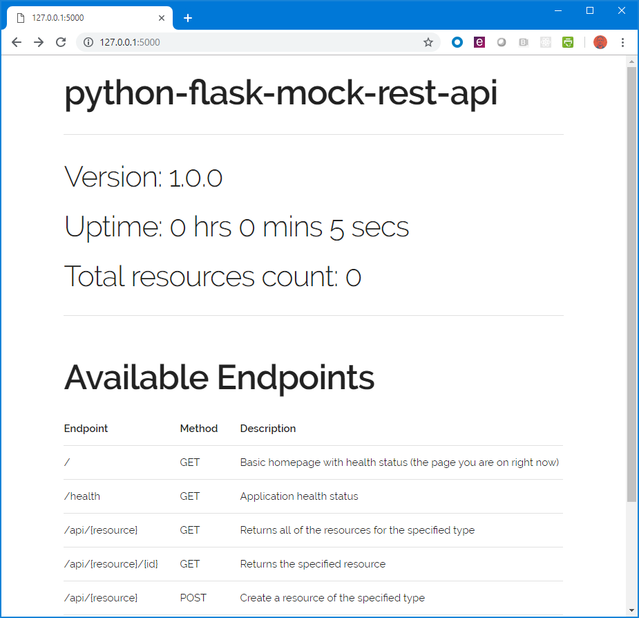

# python-flask-mock-rest-api
Mock Rest API implemented in Python (with Flask) and deployable to AWS Elastic Beanstalk.

If you're looking for a simple Flask / Elastic Beanstalk example check out [eb-python-flask](https://github.com/aws-samples/eb-python-flask).

## Overview

Exposes a REST endpoint in the form of **api/{resource}** that accepts GET/POST/PUT/DELETE and allows dynamic creation of resources. The REST endpoints available are:

|Endpoint|Method|Description|
|--------|------|-----------|
|/|GET|Basic homepage with health status information|
|/health|GET|Application health status|
|api/{resource}|GET|Returns all of the resources for the specified type|
|api/{resource}/{id}|GET|Returns the specified resource|
|api/{resource}|POST|Create a resource of the specified type|
|api/{resource}/{id}|PUT|Update the specified resource|
|api/{resource}/{id}|DELETE|Delete the specified resource|

All operations - GET/POST/PUT/DELETE - on a resource echo back the resource in the response, not just GET. The expected data format is JSON.

For example if you wanted to create a person resource, you would call:
```
 POST api/person
 {"first_name": "Darth", "last_name": "Vader"}

 Returns 200
 {"first_name": "Darth", "last_name": "Vader", "_id" : "9a02bcdc-439f-4726-9d80-8e15979ead18"}
```
When a resource is created (on POST) it is automatically assigned a UUID id. That id is then used to retrieve the resource like:
```
 GET api/person/9a02bcdc-439f-4726-9d80-8e15979ead18

 Returns 200
 {"first_name": "Darth", "last_name": "Vader", "_id" : "9a02bcdc-439f-4726-9d80-8e15979ead18"}
```
Or remove the resource like:
```
 DEL api/person/9a02bcdc-439f-4726-9d80-8e15979ead18

 Returns 200
 {"first_name": "Darth", "last_name": "Vader", "_id" : "9a02bcdc-439f-4726-9d80-8e15979ead18"}
```

Included in this project is a Postman collection and environment with example usage. Postman is an API Development and Testing tool - https://www.getpostman.com/

## Use Case
The motivation behind this project was mocking the behavior of an ERP system REST API. When writing software that integrates different software systems, it can be difficult if not impossible to have those software systems available during all phases of software development.  Especially when those different systems are large ERPs. This project is one way to mitigate that issue by creating a generic REST API that can serve as a mock for a large software system.

For example, let's say we're writing software that has to integrate with a large Human Resource System that exposes a REST API. During local development it may not be practical to have your own copy of that Human Resource System. Instead we would use a mock REST API to provide the functionality we expect. The Human Resource System might have an API that exposes these types of resources:

* Employees
* Performance Reviews
* Timesheets
* Paychecks

And the REST API might look something like:

* http://hr-server/api/employees
* http://hr-server/api/performance-reviews
* http://hr-server/api/timesheets
* http://hr-server/api/paychecks

We could run this project (locally or hosted somewhere like AWS) and load up our mock server with data by POST-ing employees, performance-reviews, timesheets and paychecks resources. Then we could work on our software and run against:

* http://your-server/api/employees
* http://your-server/api/performance-reviews
* http://your-server/api/timesheets
* http://your-server/api/paychecks

## Install
The initial development was done in Python 3.5 and there are only two dependencies. Pytest is not really required unless you want to run the tests.

```
pip3 install Flask
pip3 install pytest
```

To run locally, execute the *run_local.sh* script:
```
export RUN_LOCAL=True
export APP_VERSION=1.0.0
export APP_NAME=python-flask-mock-rest-api
python3 application.py
```
Which just sets up some environment variables the code is looking for. To run the unit tests simply run:
```
pytest
```
By default, your application is available at http://127.0.0.1:5000  



## Details
The web server in this project is relatively simple and meant as a starting point for a more complicated or detailed use case. There is no authentication/authorization for requests or query string parameters for filtering or querying data. If these are required for your particular use case you would need to implement them.

The "database" used in this project is a simple, object data store implemented in-memory (i.e., not persistent). It is designed to store resources by type and takes the liberty of assigning unique UUID's to all new resources. There is no further business logic implemented - you can POST the same resource over and over and they will be created successfully each with a new UUID. If you need more complicated logic or persistent storage you would need to implement that.

Since the database is implemented in-memory with simple python dicts and lists, its performance will be directly related to the amount of memory and processing power available. At large numbers of resources (talking millions here) it is not particularly performant.

The homepage available at the root endpoint is a basic Flask template that displays the health status information. The stylesheet is from [Skeleton](http://getskeleton.com/).

There are different ways to structure a Flask project and many guides on best practices. This project was setup to be as easy as possible to deploy to Elastic Beanstalk.

## AWS Elastic Beanstalk
A secondary goal of this project was to create something that could easily be deployed to AWS. Getting AWS setup and configured is outside the scope of this document, however it is not terribly difficult. The high level steps are:

* Get an AWS account
* [Install the AWS Command Line Interface (CLI)](https://aws.amazon.com/cli/).
* [Set up AWS Credentials for AWS CLI](https://docs.aws.amazon.com/cli/latest/userguide/cli-chap-getting-started.html)
* [Create the Elastic Beanstalk application](https://docs.aws.amazon.com/elasticbeanstalk/latest/dg/GettingStarted.html)

The easiest way to get started is to create the initial Elastic Beanstalk application manually in the AWS console. Create a new application for the Python platform and select Sample application. This will help you verify everything is setup correctly. You can then use the deploy script to replace the sample application code. The terminology can get a little confusing but the basic concept is that there are is an Elastic Beanstalk *application* and an *environment*.  An *environment* is a combination of *version* and *configuration*. The deploy script creates a new *version* and updates the *environment* to use the new *version*. You can read all about it here [What is AWS Elastic Beanstalk](https://docs.aws.amazon.com/elasticbeanstalk/latest/dg/Welcome.html).

## Deploy script
The deploy shell wraps up all the steps to zip up the code, send it to S3 and update the Elastic Beanstalk application. Big note here - the script uses the AWS CLI *not* the EB CLI.  The Elastic Beanstalk CLI is a different command line tool. Also, the zip command may not be available in your linux environment, in which case you need to install it.

To run the deploy simply type:
```
.\deploy.sh
```
However, you will need to update the variables in the script to match your setup. When you first create your Elastic Beanstalk application it will create an *application* and *environment* as well as an S3 bucket.  You need to update those values in the script.

Finally, everything is driven off the **APP_VERSION** variable. Every deploy you need to update that value. I recommend carefully examining the script to understand what it is doing and spend sometime looking around the Elastic Beanstalk AWS Console to get a feel for what is happening.

The url for your Elastic Beanstalk application will be in the AWS Console and will look something *like* http://pythonapp-env.gy69m2vhf3.us-east-2.elasticbeanstalk.com/
